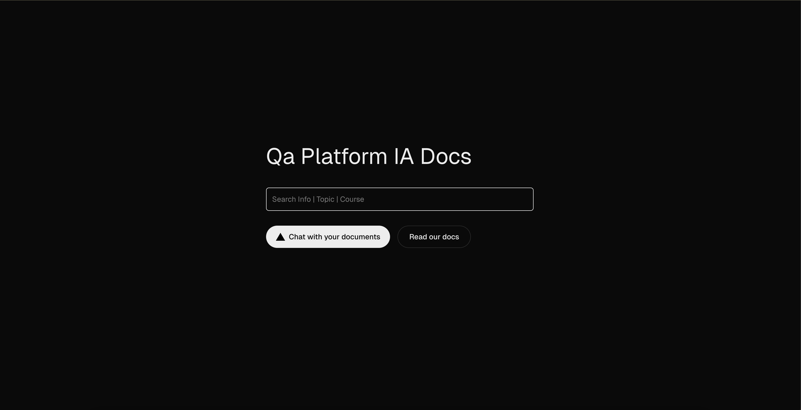

## IA DOCS

## Local setup Docker compose

1. Environment Variables (.env file):
   - Create a file named `.env` in the project root directory.
   - Add the following content to the file, replacing with your actual OpenAI token:
    ```env
    N8N_EMAIL=dev@localhost.com
    N8N_PASSWORD=Testing321
    OPEN_AI_API_KEY=your_openai_api_key
    ```

2. Run docker compose command

```bash
docker compose up
```

3. Open n8n [http://127.0.0.1:5678/](http://127.0.0.1:5678/)

    **Use credentials dedined on .env file**

4. Open worflow ia docs and activate the worflow


5. Open UI [http://localhost/](http://localhost/)


